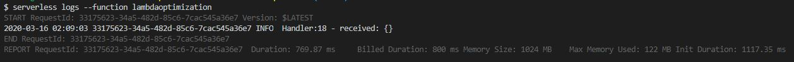

# aws-lambda-coldstart-optimised

An example module to demonstarte the cold start optimization of aws-lambda in Java.

Create a new serverless Java project using serverless template

  `sls create --template aws-java-maven`

A new serverless project is created in your working directory,update the default configurations in pom.xml and serverless.yml and run 

    mvn clean install
    sls deploy

Once the function code is built and deployed to your aws environment , invoke function using below command

    sls invoke --function {function_name}

If everything goes fine , we should receive the following response

    {
    "statusCode": 200,
    "body": "{\"message\":\"Go Serverless v1.x! Your function executed successfully!\",\"input\":{}}",
    "headers": {
        "X-Powered-By": "AWS Lambda & serverless"
    },
    "isBase64Encoded": false
    }

Now lets go and check the logs

    serverless logs --function {function_name}

